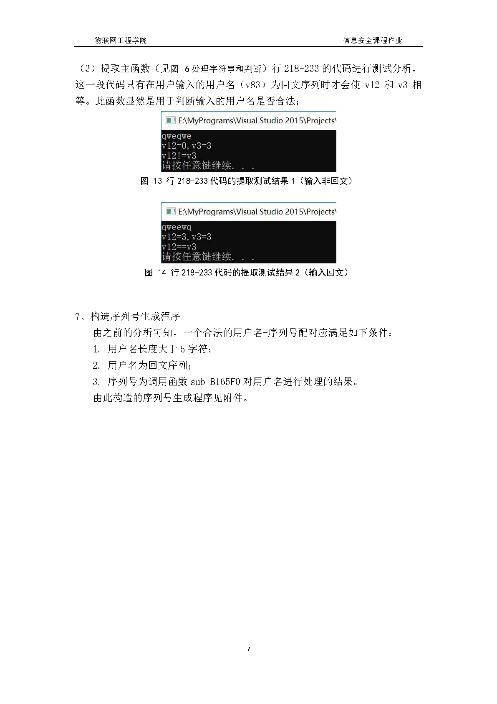

# 信息安全作业

## 这个项目是我的计算机网络课程设计，完成时间为2018年12月。

## 作业来自于Mark Stamp的信息安全教材Information security: principles and practice, 2nd Edition，目标是用IDA反编译一个密钥验证程序然后抽取其中和密钥有关的代码编写一个密钥生成器。这个文件夹里面只有写好的密钥生成器。

## 下面是作业pdf👇

